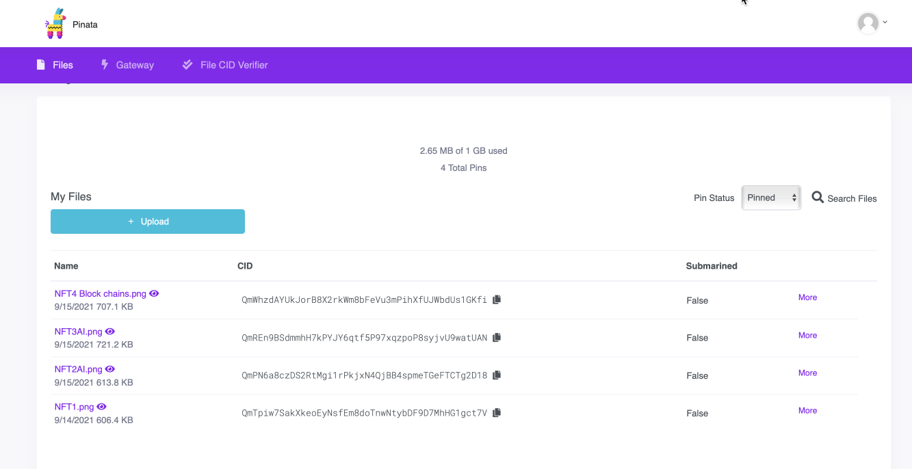
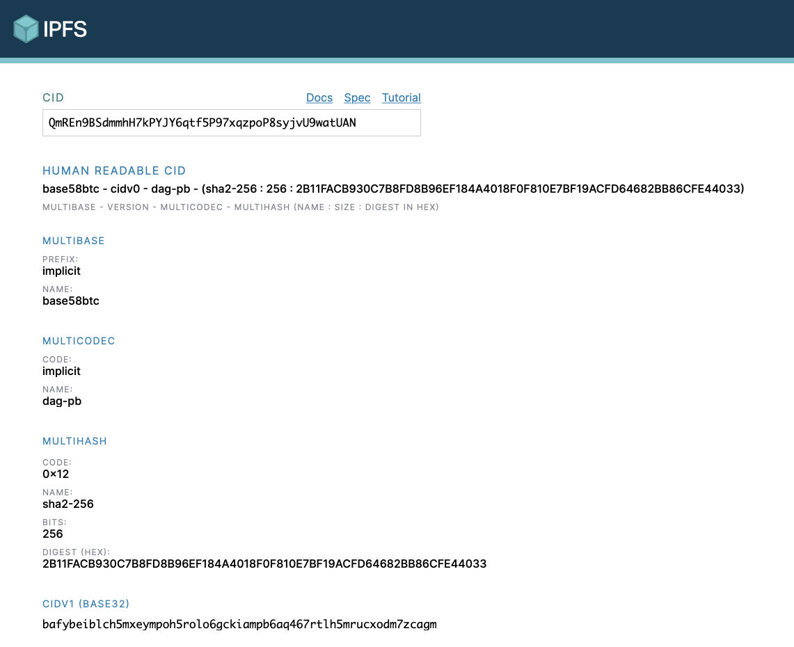
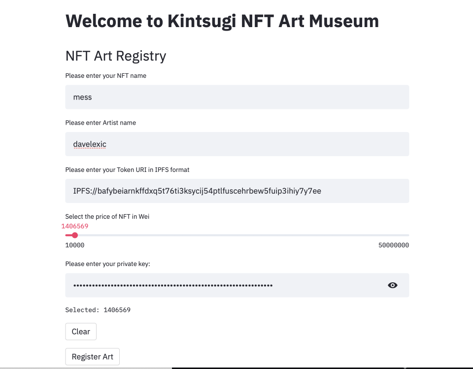
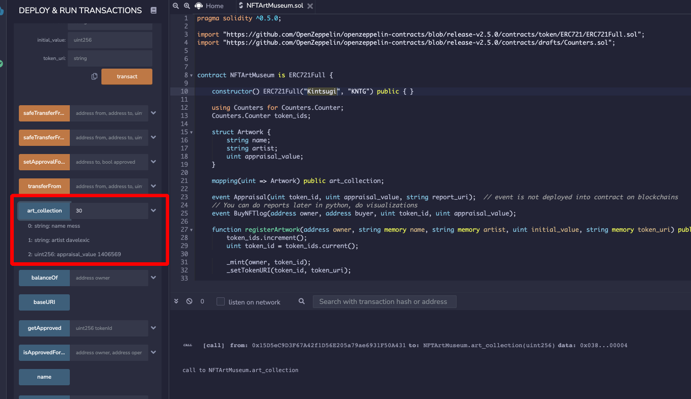
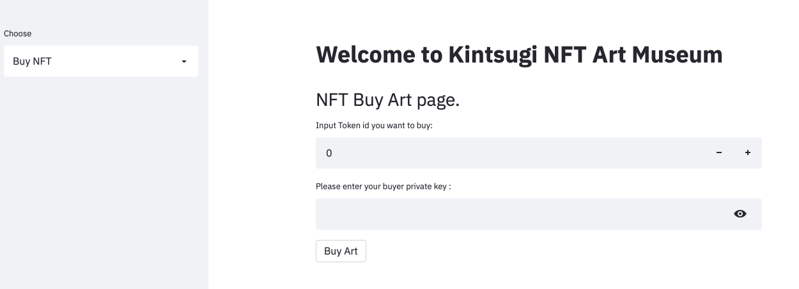
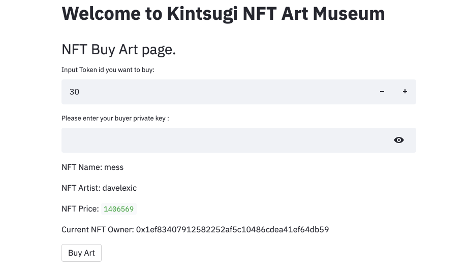

Chakravarti Raghavan's README.md

Below is NFTArt Museum solidity contract and Python Web3 interface with Steamlit Web for users

1. Python file: NFTArtMuseumSL.py

2. link to Remix Solidity Contract  

   [NFTArtMuseum Solidity code](https://gist.github.com/rchak007/bcb032abe765e45f2800de85e786dc9c)

   

   

- Pinata - NFT storage made easy & Hosted on IPFS - 
  - Pinata makes **file storage easy** for everyone. Whether it's images or video, 3D files or an app, easily take your creations and share it with the world.
  - You may come across NFT assets that are hosted on platforms such as Amazon S3, Google Cloud, or even Dropbox. None of these solutions are well suited for something that you almost certainly want to prove the authenticity of.
  - The key advantage IPFS provides to data is its immutable and content addressed nature. When data is uploaded to IPFS, the protocol generates a unique ID for that data. Think of it like a car vin for each piece of data.

So we have  designed a quick StreamLit web App which will be expanded later on to have more bells and whistles.

**Time to MINT your NFT!!**

- OpenZeppelin Contracts helps you minimize risk by using battle-tested libraries of smart contracts for Ethereum and other blockchains. It includes the most used implementations of ERC standards.

- Remix IDE is **an open source web and desktop application**. ... Remix IDE is a powerful open source tool that helps you write Solidity contracts straight from the browser. It is written in JavaScript and supports both usage in the browser, in the browser but run locally and in a desktop version.
- MetaMask is a software cryptocurrency wallet used to interact with the Ethereum blockchain. It allows users to access their Ethereum wallet through a browser extension or mobile app, which can then be used to interact with decentralized applications.

- Web3.py is **a Python library built for interacting with the Ethereum blockchain**  that **allow you to interact with a local or remote ethereum node using HTTP, IPC or WebSockets**. With it we can build all sorts of core functionality for decentralized applications. We can interact with smart contracts directly, gather blockchain data, and send transactions.
- Infura is **a Web3 backend and Infrastructure-as-a-Service (IaaS) provider** that offers a range of services and tools for blockchain developers.Infura **provides the tools and infrastructure that allow developers to easily take their blockchain application from testing** to scaled deployment - with simple, reliable access to Ethereum and IPFS. ... There are many pain points for blockchain developers that can be solved by Infura.
- Streamlit is **an open-source python framework for building web apps for Machine Learning and Data Science**

Below is link to Remix Solidity Contract 

[NFTArtMuseum Solidity code](https://gist.github.com/rchak007/bcb032abe765e45f2800de85e786dc9c)

and here is screen snippet:

