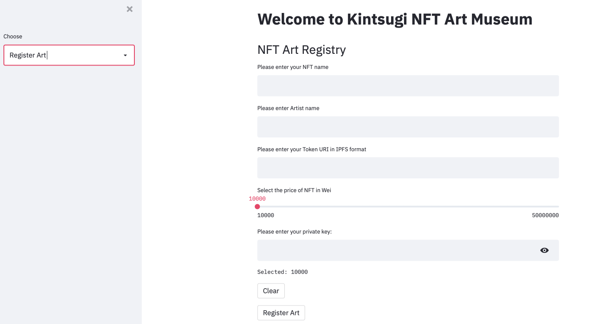
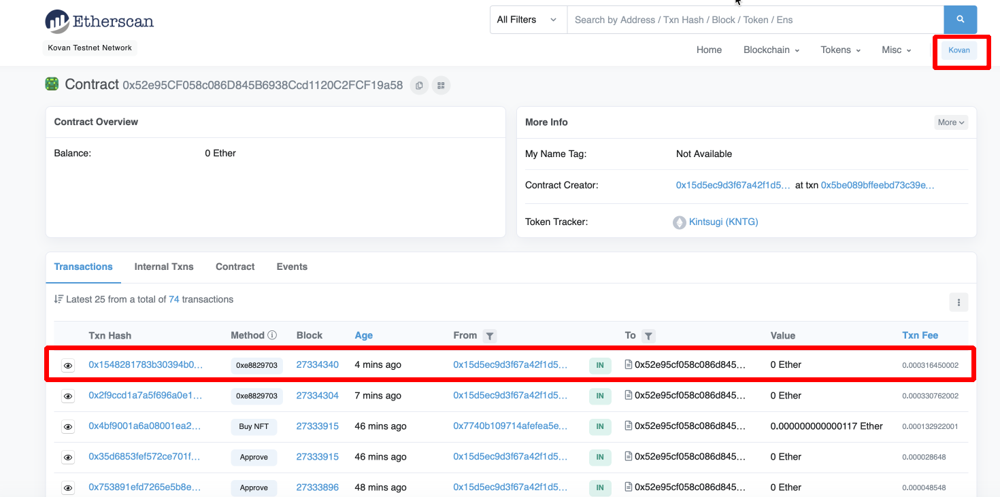
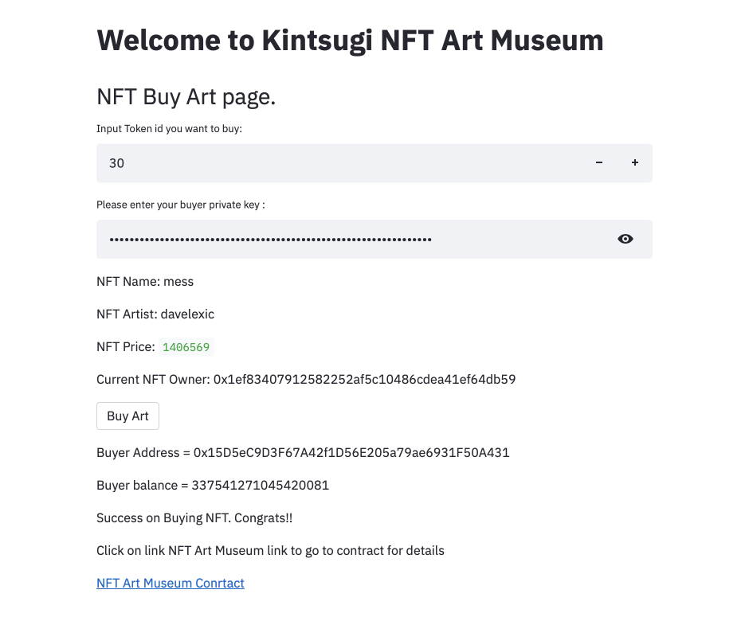
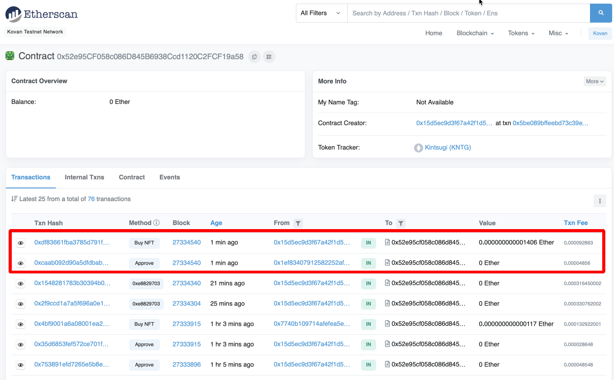
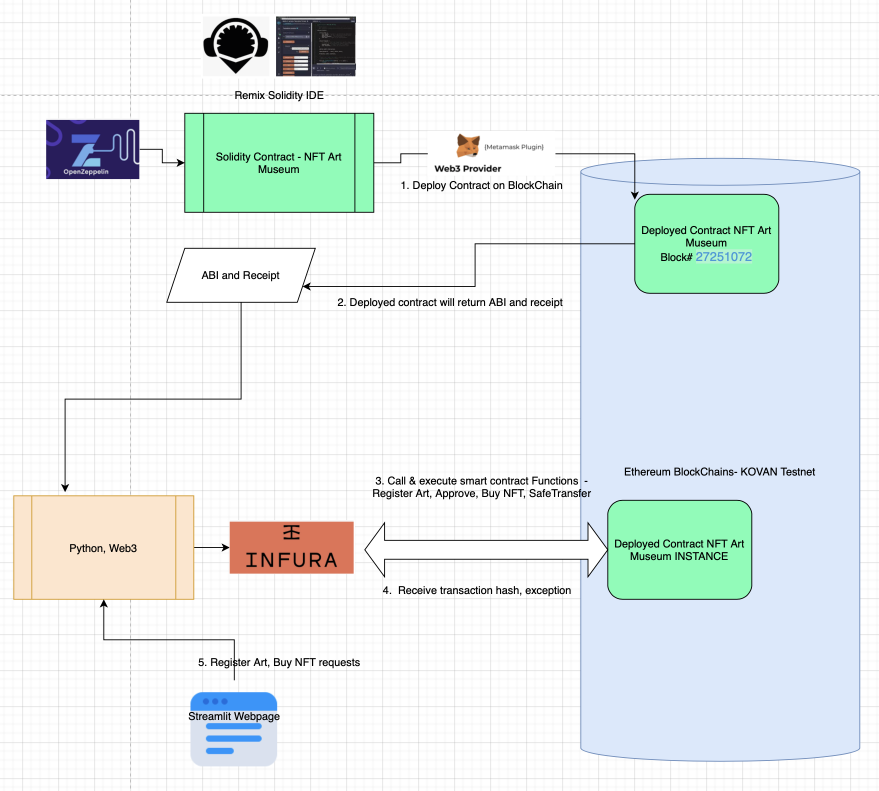

#### 

# Implemented NFTArt Museum solidity contract with Python Web3 &  Steamlit Web UI 

1. Python file: NFTArtMuseumSL.py

2. link to Remix Solidity Contract  

   [NFTArtMuseum Solidity code](https://gist.github.com/rchak007/bcb032abe765e45f2800de85e786dc9c)

   

   

## Pinata Cloud storage

Pinata was used to store NFT Art which has IPFS enabled.

- Pinata - NFT storage made easy & Hosted on IPFS - 
  - Pinata makes **file storage easy** for everyone. Whether it's images or video, 3D files or an app, easily take your creations and share it with the world.
  - You may come across NFT assets that are hosted on platforms such as Amazon S3, Google Cloud, or even Dropbox. None of these solutions are well suited for something that you almost certainly want to prove the authenticity of.
  - The key advantage IPFS provides to data is its immutable and content addressed nature. When data is uploaded to IPFS, the protocol generates a unique ID for that data. Think of it like a car vin for each piece of data.

## IPFS - InterPlanetary File System

CIDV1 hash is obtained by using Pinata CID in the below link:

[IPFS CIDV1 from V0](https://cid.ipfs.io)

## StreamLit web App

So we have  designed a quick StreamLit web App which will be expanded later on to have more bells and whistles.

### **Time to MINT your NFT!!**

Below we give the NFT name, Artist name, Token URI from IPFS, Price and Artist's private key so later we have approval to tranfer their NFT to buyer and also we will use that address to get the money when NFT is sold.

Clicking on above link takes us to Etherscan to view the transaction details.

### Etherscan NFT Mint details

### Remix IDE - NFT Contract function verification

We can also go to Remix and verify some details.

### Buy NFT 

Now below we illustrade a Buy NFT transaction from UI.

We enter the Token ID that needs to be bought. When we do that the NFT name, Artist name, and Price info is shown to verify if thats the NFT they want to buy.

Then the Buyer also enters their Private key so that gives permission to tranfer the price from their address to Owners address and then token id is transferred from the Owner to Buyer so now they own the NFT.

### Etherscan NFT Buy details

Again we can go to Etherscan to verify the address.

### Architecture the NFT Art Museum contract

## Implementation

### 	

### OpenZeppelin Contracts

OpenZeppelin Contracts helps you minimize risk by using battle-tested libraries of smart contracts for Ethereum and other blockchains. It includes the most used implementations of ERC standards.

### Remix IDE - Solidity contract

Remix IDE is **an open source web and desktop application**. ... Remix IDE is a powerful open source tool that helps you write Solidity contracts straight from the browser. It is written in JavaScript and supports both usage in the browser, in the browser but run locally and in a desktop version.

Below is link to Remix Solidity Contract 

[NFTArtMuseum Solidity code](https://gist.github.com/rchak007/bcb032abe765e45f2800de85e786dc9c)

and here is screen snippet:

### MetaMask

MetaMask is a software cryptocurrency wallet used to interact with the Ethereum blockchain. It allows users to access their Ethereum wallet through a browser extension or mobile app, which can then be used to interact with decentralized applications.

### Web3 Python

Web3.py is **a Python library built for interacting with the Ethereum blockchain**  that **allow you to interact with a local or remote ethereum node using HTTP, IPC or WebSockets**. With it we can build all sorts of core functionality for decentralized applications. We can interact with smart contracts directly, gather blockchain data, and send transactions.

See file "NFTArtMuseumSL.py"

### Infura 

Infura is **a Web3 backend and Infrastructure-as-a-Service (IaaS) provider** that offers a range of services and tools for blockchain developers.Infura **provides the tools and infrastructure that allow developers to easily take their blockchain application from testing** to scaled deployment - with simple, reliable access to Ethereum and IPFS. ... There are many pain points for blockchain developers that can be solved by Infura.

### Streamlit

Streamlit is **an open-source python framework for building web apps for Machine Learning and Data Science**

